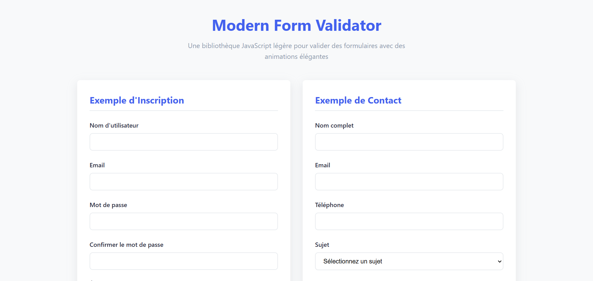

# Modern Form Validator

Une bibliothèque JavaScript légère pour valider des formulaires avec des animations élégantes et des messages d'erreur personnalisables.

## Aperçu du projet



## Fonctionnalités

- Validation complète de formulaires sans dépendances externes
- Animations élégantes pour les états d'erreur et de succès
- Messages d'erreur personnalisables
- Support pour de nombreux types de validation
- Responsive et accessible
- Facile à intégrer et à personnaliser
- Moins de 5KB minifié

## Validations disponibles

- `required` - Champ obligatoire
- `email` - Adresse email valide
- `minLength:X` - Longueur minimale de X caractères
- `maxLength:X` - Longueur maximale de X caractères
- `min:X` - Valeur minimale de X (pour les nombres)
- `max:X` - Valeur maximale de X (pour les nombres)
- `number` - Valeur numérique valide
- `alphanumeric` - Caractères alphanumériques uniquement
- `password` - Mot de passe fort (8+ caractères, majuscule, minuscule, chiffre)
- `match:fieldName` - Correspondance avec un autre champ
- `phone` - Numéro de téléphone valide
- `url` - URL valide
- `date` - Date valide

## Installation

### Option 1: Téléchargement direct

Téléchargez les fichiers et incluez-les dans votre projet:

```html
<link rel="stylesheet" href="css/styles.css">
<script src="js/formValidator.js"></script>
```

### Option 2: CDN

Incluez la bibliothèque directement depuis un CDN:

```html
<script src="https://cdn.exemple.com/formValidator.min.js"></script>
```

## Guide d'utilisation

### 1. HTML

Ajoutez l'attribut `data-validate` à vos champs de formulaire en spécifiant les validations souhaitées:

```html
<form id="monFormulaire" class="modern-form" novalidate>
    <div class="form-group">
        <label for="email">Email</label>
        <input type="email" id="email" name="email" 
               data-validate="required,email">
        <div class="error-message"></div>
    </div>
    
    <div class="form-group">
        <label for="password">Mot de passe</label>
        <input type="password" id="password" name="password" 
               data-validate="required,minLength:8,password">
        <div class="error-message"></div>
    </div>
    
    <div class="form-group">
        <button type="submit">Se connecter</button>
    </div>
</form>
```

### 2. JavaScript

Initialisez le validateur de formulaire:

```javascript
document.addEventListener('DOMContentLoaded', function() {
    const validator = new ModernFormValidator('#monFormulaire', {
        // Options (facultatives)
        onSuccess: function(form) {
            console.log('Formulaire validé!');
            // Soumettre le formulaire par AJAX ou autre
        }
    });
});
```

## Options de configuration

```javascript
const validator = new ModernFormValidator('#monFormulaire', {
    errorClass: 'error',                // Classe CSS pour les états d'erreur
    successClass: 'success',            // Classe CSS pour les états de succès
    errorMessageClass: 'error-message', // Classe CSS pour les messages d'erreur
    animationDuration: 300,             // Durée des animations en ms
    validateOnInput: true,              // Valider lors de la saisie
    validateOnBlur: true,               // Valider lors de la perte de focus
    onSuccess: null,                    // Callback en cas de succès
    
    // Messages d'erreur personnalisés
    errorMessages: {
        required: 'Ce champ est obligatoire',
        email: 'Veuillez entrer une adresse email valide',
        // etc.
    },
    
    // Validateurs personnalisés
    customValidators: {
        // Exemple de validateur personnalisé
        postalCode: function(field) {
            return /^[0-9]{5}$/.test(field.value);
        }
    }
});
```

## API publique

### Méthodes

- `validator.reset()` - Réinitialise le formulaire et ses états
- `validator.validateAllFields()` - Valide tous les champs et retourne true/false
- `validator.validateField(field)` - Valide un champ spécifique
- `validator.addValidator(name, fn, errorMessage)` - Ajoute un validateur personnalisé
- `validator.setErrorMessage(validatorName, message)` - Personnalise un message d'erreur

### Exemple d'ajout d'un validateur personnalisé

```javascript
validator.addValidator(
    'codePostal', 
    function(field) {
        return /^[0-9]{5}$/.test(field.value);
    },
    'Veuillez entrer un code postal valide (5 chiffres)'
);
```

## Personnalisation CSS

Le fichier CSS inclut des variables que vous pouvez modifier pour adapter l'apparence à votre design:

```css
:root {
    --primary: #4361ee;
    --error: #ef476f;
    --success: #06d6a0;
    /* et plus encore... */
}
```

## Compatibilité navigateurs

- Chrome 60+
- Firefox 55+
- Safari 11+
- Edge 16+
- Opera 47+

## Licence

Ce projet est disponible sous licence MIT.

---

## 👨‍💻 Auteur
Créé par [Eryaz](https://github.com/eryaz2025)